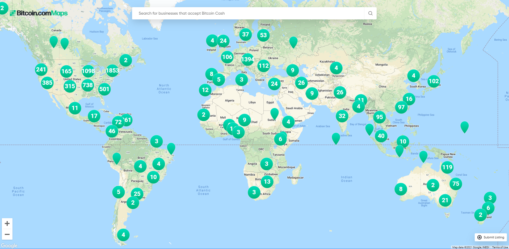

# Bitcoin Cash (BCH)

Bitcoin Cash (ticker symbol: BCH) is a decentralized uncensorable peer-to-peer electronic cash system as outlined in the [Bitcoin whitepaper](http://bitcoin.com/bitcoin.pdf) by Satoshi Nakamoto that has fast, secure, reliable, and low fee transactions running on a permissionless blockchain network. Bitcoin Cash is the upgraded version of Bitcoin which carries the same genesis block that was started with Bitcoin in January 2009. You can learn more about it by reading *[What is Bitcoin Cash](https://bitcoincash.substack.com/p/what-is-bitcoin-cash-bch)*.

# Bitcoin Cash Client Software

BCH doesn't have a single official Github repository. Due to it's decentralized blockchain and p2p network, there are several Bitcoin Cash software client implementations, listed below in no specific order. Since each implementation has it's own team of developers that works to keep it's client compatible with the rest of the network, there is no central point of weakness.

## Bitcoin Cash Node
* [Website](https://bitcoincashnode.org/) 
* [Project Repository](https://gitlab.com/bitcoin-cash-node/bitcoin-cash-node)

## Bitcoin Unlimited 
* [Website](https://www.bitcoinunlimited.info/) 
* [Project Repository](https://github.com/BitcoinUnlimited/BitcoinUnlimited)

## BCHD
* [Website](https://bchd.cash/) 
* [Project Repository](https://github.com/gcash/bchd)

## Bitcoin Verde
* [Website](https://bitcoinverde.org/documentation/) 
* [Project Repository](https://github.com/SoftwareVerde/bitcoin-verde)

## Flowee the Hub
* [Website](https://flowee.org/) 
* [Project Repository](https://gitlab.com/FloweeTheHub)

## Knuth
* [Website](http://kth.cash/) 
* [Project Repository](https://github.com/k-nuth/kth)

# Bitcoin Cash Protocol Development

Below is a highlighted list of completed protocol developments on the Bitcoin Cash blockchain. This is not an all-inclusive list. You can see a full list of [BCH developments here](https://cash.coin.dance/development) which includes not yet completed proposals and projects.

* [ASERT Difficulty Adjustment Algorithm](https://upgradespecs.bitcoincashnode.org/2020-11-15-asert/)
* [Default to 32MB blocks](https://github.com/Bitcoin-ABC/bitcoin-abc/commit/699f4b867318486b915bd2d3b2102fb49ec652f1#diff-cbe22f30d7e480617350ef6ceca97d0c)
* [Scale to make 250MB blocks reliable](https://flowee.org/releases/201906-release/)
* [Increase chained tx limit from 25 to 50](https://github.com/Bitcoin-ABC/bitcoin-abc/commit/f265c59f93dad03dcdcd09b77c0d9692afe9ddc6)
* [CashShuffle](https://github.com/cashshuffle/cashshuffle-electron-cash-plugin/wiki/Protocol-Description)
* [CashFusion](https://github.com/cashshuffle/spec/blob/master/CASHFUSION.md)
* [Enable Schnorr signatures](https://github.com/bitcoincashorg/bitcoincash.org/blob/master/spec/2019-05-15-schnorr.md)
* [Enable Schnorr Signatures on OP_CHECKMULTISIG](https://github.com/bitcoincashorg/bitcoincash.org/pull/375)
* [CashID](https://gitlab.com/cashid/protocol-specification)
* [CompactBlocks](https://bitco.in/forum/threads/buip051-passed-add-compactblocks-support.2017/)
* [Simple Ledger Protocol](https://www.reddit.com/r/btc/comments/8zxfu5/introducing_simple_ledger_protocol_slp_a_token/)
* [Fast Sync via IPFS](https://medium.com/@bchd.cash/announcing-bchd-0-13-0-beta2-with-fast-sync-mode-4d4b741d27c5)
* [Graphene v1](https://github.com/BitcoinUnlimited/BitcoinUnlimited/pull/973)
* [Smart Bitcoin Cash sidechain (EVM smart contracts)](https://github.com/smartbch)

# Bitcoin Cash Mining

Bitcoin Cash (BCH) uses the SHA-256 hashing algorithm, which is the same mining algorithm used by Bitcoin (BTC), as both coins share the same blockchain genesis. Miners can easily switch between the two coins, and miners are distributed all over the world. Miners can leave and rejoin the network at will. Below is a [snapshot](https://cash.coin.dance/blocks/thisweek) of the last 7 days of mining BCH blocks as provided by Coin.Dance.

# Bitcoin Cash Trading

Bitcoin Cash (BCH) is traded on all major exchange platforms, including but not limited to Coinbase, Kraken, Gemini, Bitstamp, Robinhood, Shapeshift, Binance, Bitfinex, and many others. 

# Bitcoin Cash Wallets

Bitcoin Cash (BCH) is supported by all major wallet providers, including but not limited to Bitcoin.com, Blockchain.com, Electron Cash, Edge, Bitpay, Ledger, Trezor, Exodus, BitGo, and many others.

# Bitcoin Cash Ecosystem 

For a more comprehensive list of other BCH ecosystem projects that use Bitcoin Cash, visit the [Bitcoin Cash Projects list](https://www.bitcoin.com/bitcoin-cash-projects/) to see what kind of applications and tools are being built around this decentralized network. [Swan Cash](https://swan.cash/) is also featuring BCH projects too. 

# Bitcoin Cash Adoption 

Bitcoin Cash is accepted all over the world. In the [Bitcoin Map](https://map.bitcoin.com/), there are over 10,000+ merchants that are accepting BCH as payment. There are other maps that support BCH, such as [Cryptwerk](https://cryptwerk.com/coinmap/bch/), [Anypay](https://anypay.city/), and [Bmap](https://bmap.app/). There are Bitcoin Cash merchant directories, such as [BitPay](https://bitpay.com/directory/), [Accept BCH](https://acceptbitcoin.cash/), [Cryptwerk](https://cryptwerk.com/pay-with/bch/), and [Green Pages](https://greenpages.cash/). There are several services that support working for BCH like [Bitwage](https://www.bitwage.com/), [Working for Bitcoins](https://workingforbitcoins.com/), [LazyFox](https://lazyfox.io/), and [Venezuela Workers](https://venezuelaworkers.com/). If you want to meetup with others, you can use the [Bitcoin Cash Meetup](https://www.meetup.com/topics/bitcoin-cash/) group to connect with thousands of people around the world. 

# Notable Companies 

Bitcoin Cash (BCH) is supported by many thousands of big and small companies around the world, which is simply too many to list. Here are just a few notable companies that support BCH, in no particular order:

* PayPal ([source](https://www.reuters.com/article/paypal-cryptocurrency/paypal-to-allow-cryptocurrency-buying-selling-and-shopping-on-its-network-idINL1N2HB14U))
* Venmo ([source](https://www.theverge.com/2020/10/21/21527288/paypal-cryptocurrency-support-buy-sell-venmo-bitcoin ))
* Revolut ([source](https://techcrunch.com/2018/05/23/revolut-adds-ripple-and-bitcoin-cash-support/))
* HTC ([source](https://www.engadget.com/2019-09-16-htc-exodus-1-bitcoin-cash-partnership.html))
* Microsoft ([source](https://www.trustnodes.com/2018/03/13/microsoft-starts-accepting-bitcoin-cash))
* AMC ([source](https://thecryptobasic.com/2021/09/16/amc-the-biggest-cinema-chain-worldwide-with-1004-theaters-11041-screens-to-start-accepting-ethereum-bitcoin-cash-and-litecoin/))
* JP Morgan ([source](https://web.archive.org/web/20210722144131/https://www.businessinsider.com/jpmorgan-financial-advisors-crypto-bitcoin-products-retail-wealth-management-2021-7))
* Wikipedia ([source](https://coinrivet.com/wikipedia-is-now-accepting-bitcoin-cash-donations/ ))
* Hong Kong Free Press ([source](https://finance.yahoo.com/news/hong-kong-free-press-accepts-115303129.html))
* eToro ([source](https://aithority.com/technology/cryptocurrency/etoro-adds-bitcoin-cash/))
* Rakuten ([source](https://cryptonews.com/news/giant-rakuten-to-let-customers-charge-e-pay-accounts-with-bt-9343.htm))
* International Game Technology ([source](https://www.coindesk.com/igt-patents-bitcoin-gambling-funding))
* Travala ([source](https://blog.travala.com/travala-com-and-bitcoin-com-empower-over-four-million-travellers-to-save-on-hotel-stays/))
* Namecheap ([source](https://news.bitcoin.com/namecheap-lets-you-buy-a-domain-and-host-your-website-with-bitcoin-cash/))
* Overstock ([source](https://www.finextra.com/newsarticle/30939/online-retailer-overstock-starts-accepting-bitcoin-cash-and-ethereum))
* CheapAir ([source](https://www.prnewswire.com/news-releases/cheapaircom-and-bitcoincom-partner-to-serve-bitcoin-cash-travelers-300893373.html))
* Whole Foods ([source](https://www.fastcompany.com/90348494/the-winklevoss-twins-want-to-take-cryptocurrency-mainstream))
* Wix ([source](https://www.businesswire.com/news/home/20211012005376/en/BitPay-Partners-with-Wix-Enabling-Wix-Merchants-to-Accept-Crypto-Payments))
* eGifter ([source](https://www.egifter.com/buy-gift-cards-with-bitcoin-cash))
* Robinhood ([source](https://www.cnbc.com/2018/07/12/trading-app-robinhood-adds-two-new-cryptocurrencies-despite-bear-marke.html))
* Coinbase ([source](https://finance.yahoo.com/news/coinbase-adds-buying-selling-bitcoin-cash-094008738.html))
* Bitpay ([source](https://news.bitcoin.com/payment-platform-bitpay-adds-bitcoin-cash-settlement-services/))
* Blockchain ([source](https://www.macobserver.com/news/product-news/blockchain-info-support-bitcoin-cash/))
* Grayscale ([source](https://grayscale.co/bitcoin-cash-trust/))
* Gemini ([source](https://www.forbes.com/sites/michaeldelcastillo/2018/05/14/winklevoss-brothers-bitcoin-exchange-adds-zcash/))
* Bitmain ([source](https://www.nytimes.com/2017/07/25/business/dealbook/bitcoin-cash-split.html))
* ViaBTC ([source](https://www.nytimes.com/2017/07/25/business/dealbook/bitcoin-cash-split.html))

# Notable People 

Bitcoin Cash (BCH) is supported by many millions of people around the world too. Here are just a few big names that support BCH, in no particular order:

* Tim Drapper ([source](https://news.bitcoin.com/tim-draper-heaps-praise-on-bitcoin-cash/))
* Elon Musk ([source](https://www.independent.co.uk/life-style/gadgets-and-tech/bitcoin-buy-guide-how-to-b1821972.html))
* Kim Dotcom ([source](https://www.financemagnates.com/cryptocurrency/bitcoin-cash-bch-soars-after-kim-dotcom-support/))
* Mark Cuban ([source](https://twitter.com/DavidShares/status/1450204533154582533))
* John McAfee ([source](https://moneymorning.com/2017/11/15/john-mcafee-says-you-cant-deny-the-reality-of-bitcoin-cash/ ))
* Rick Falkvinge ([source](https://www.wired.com/beyond-the-beyond/2017/11/rick-falkvinge-bitcoin-cash-manifesto/))
* Bryan Kelly ([source](https://www.cnbc.com/2018/05/21/crypto-investor-brian-kelly-makes-the-case-for-bitcoin-cash.html))
* Swizz Beatz (Kasseem Dean) ([source](https://youtu.be/cveFouBiWzo?t=1153))
* Roger Ver ([source](https://www.cnbc.com/2018/05/15/why-bitcoin-jesus-is-so-bullish-about-bitcoin-cash.html))
* Jeffrey Tucker ([source](https://www.youtube.com/watch?v=O_2IFV7zKe4))
* Vinny Lingham ([source](https://www.cnbc.com/2018/01/25/vinny-lingham-thinks-bitcoin-cash-will-outpace-bitcoin-in-the-future.html))
* Vitalik Buterin  ([source](https://decrypt.co/7885/vitalik-buterin-bitcoin-cash-ethereum-scalability))
* Jihan Wu ([source](https://coinmarketcap.com/headlines/news/first-ever-bitcoin-cash-bch-option-to-be-launched-by-bitmain-founder-jihan-wu/))
* Gavin Andresen ([source](https://twitter.com/gavinandresen/status/929377620000681984))
* Balaji Srinivasan ([source](https://twitter.com/balajis/status/956662721465827329))
* Rolando Brison - Parliament of St. Maarten ([source](https://news.bitcoin.com/member-of-st-maartens-parliament-plans-to-have-his-entire-salary-paid-in-bitcoin-cash/))
* Mike Maloney ([source](https://twitter.com/mike_maloney/status/1348640138470051846))
* Peter Smith ([source](https://twitter.com/OneMorePeter/status/931311757116694528))
* Erik Voorhees ([source](https://twitter.com/ErikVoorhees/status/892745848106307584))
* Mike Hearn ([source](https://www.ccn.com/think-heretical-thoughts-mike-hearn-tells-bitcoin-cash/))
* Brock Pierce ([source](https://twitter.com/brockpierce/status/1031536253894840320))
* Paul Puey ([source](https://twitter.com/paullinator/status/943520781086031873))
* Chris Pacia ([source](https://news.bitcoin.com/developers-unveil-two-new-bitcoin-cash-full-node-clients-written-in-go/))
* Kyle Samani ([source](https://www.forbes.com/sites/laurashin/2017/11/12/bitcoin-cash-skyrockets-bitcoin-price-drops-as-civil-war-continues/))
* Aigil Gomez ([source](https://www.instagram.com/p/CPmWHBRgA04/))
* Rapper Lil Pump ([source](https://cheddar.com/media/ceo-of-sweet-talks-nft-partnership-with-rapper-lil-pump))
* Rapper Lil Windex ([source](https://www.youtube.com/watch?v=nAMRFDs9iOs))
* Rapper RiFF RAFF ([source](https://twitter.com/DavidShares/status/1384507667188682753))
* Pro-Tennis player Oleksandra Oliynykova ([source](https://zephyrnet.com/this-tennis-pro-is-auctioning-part-of-her-arm-as-an-nft/))
* MMA Fighter Rory McDonald ([source](https://www.newsbtc.com/news/mma-champ-rory-mcdonald-teamed-bitcoin-cash/))
* MMA Fighter Gordon Ryan ([source](https://jiujitsutimes.com/gordon-ryan-signs-sponsorship-deal-with-bitcoin-cash-worth-100k-for-adcc-2022/))
* Pro-Cricket player Chris Gayle ([source](https://old.reddit.com/r/btc/comments/te6xkb/so_the_universe_boss_chris_gayle_is_paying_at/))

# Contributing 

If you want to contribute to this page, please see [CONTRIBUTING.md](/CONTRIBUTING.md).

# Support

This page has been updated and added with a permament website which you can visit and support @  [BitcoinProtocol.org](https://bitcoinprotocol.org/).
